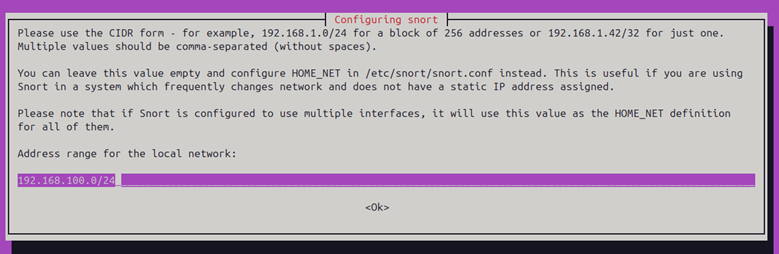
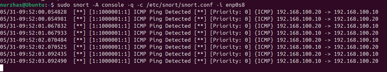
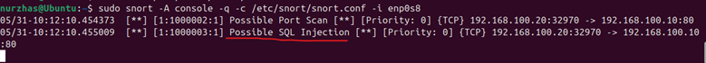
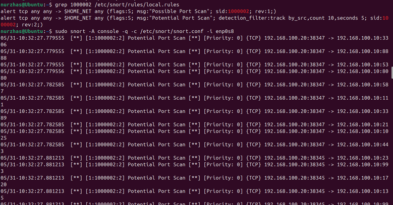
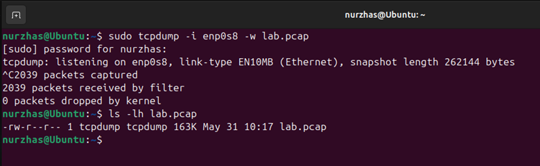
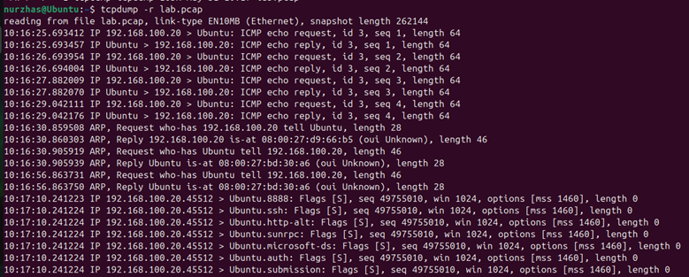

# 🛡️ Snort IDS Detection Engineering Lab

> Detection Engineering • Network Security • Threat Detection • PCAP Analysis

A hands-on Blue Team project focused on deploying, tuning, and validating a Snort Intrusion Detection System (IDS) in a VirtualBox lab environment.

---

# 📋 Table of Contents

* [Project Overview](#-project-overview)
* [Lab Architecture](#-lab-architecture)
* [Technologies Used](#-technologies-used)
* [Detection Rules](#-detection-rules)
* [Attack Simulation](#-attack-simulation)
* [False Positive Tuning](#-false-positive-tuning)
* [PCAP Capture and Replay](#-pcap-capture-and-replay)
* [Detection Evidence](#-detection-evidence)
* [Skills Demonstrated](#-skills-demonstrated)
* [Repository Structure](#-repository-structure)

---

# 🎯 Project Overview

This project demonstrates the deployment and configuration of a Snort-based Intrusion Detection System (IDS) using Ubuntu and Kali Linux virtual machines.

The objective was to:

* Deploy a working IDS sensor
* Develop custom Snort detection signatures
* Simulate attack traffic
* Capture and replay packet data
* Reduce false positives through rule tuning
* Validate detections against replayed traffic

The project follows a practical Detection Engineering workflow commonly used in SOC and Blue Team environments.

---

# 🏗️ Lab Architecture

| Host       | Role                   | IP Address     |
| ---------- | ---------------------- | -------------- |
| Ubuntu     | Snort IDS Sensor       | 192.168.100.10 |
| Kali Linux | Attack Simulation Host | 192.168.100.20 |

### Network Configuration



Snort monitored traffic traversing the isolated VirtualBox Internal Network.

---

# ⚙️ Technologies Used

| Category         | Technology   |
| ---------------- | ------------ |
| Operating System | Ubuntu       |
| Attack Platform  | Kali Linux   |
| IDS              | Snort 2.9.20 |
| Web Service      | Apache2      |
| Reconnaissance   | Nmap         |
| Packet Capture   | Tcpdump      |
| Packet Replay    | Tcpreplay    |
| Virtualization   | VirtualBox   |

---

# 🚨 Detection Rules

## ICMP Host Discovery Detection

Detects ICMP Echo Requests used during reconnaissance.

**SID:** 1000001

---

## TCP SYN Port Scan Detection

Detects Nmap SYN scanning activity.

**SID:** 1000002

---

## HTTP SQL Injection Detection

Detects UNION-based SQL Injection attempts.

**SID:** 1000003

---

# 🎯 Attack Simulation

The following attack scenarios were generated from Kali Linux:

### ICMP Discovery

```bash
ping -c 5 192.168.100.10
```

### SYN Scan

```bash
nmap -sS 192.168.100.10
```

### SQL Injection Simulation

```bash
curl "http://192.168.100.10/?id=1+union+select"
```

Snort successfully generated alerts for all attack scenarios.

---

# 🔍 Detection Evidence

## ICMP Detection

Custom Snort rule successfully detected ICMP host discovery activity.



---

## Port Scan Detection

Snort detected TCP SYN reconnaissance generated by Nmap.


---

## SQL Injection Detection

Custom HTTP rule detected a UNION-based SQL Injection attempt.



---

# 🎯 False Positive Tuning

The original port scan rule generated alerts for every TCP SYN packet.

## Original Rule

```snort
alert tcp any any -> $HOME_NET any (flags:S; msg:"Possible Port Scan"; sid:1000002; rev:1;)
```

## Tuned Rule

```snort
alert tcp any any -> $HOME_NET any (flags:S; msg:"Potential Port Scan"; detection_filter:track by_src,count 10,seconds 5; sid:1000002; rev:2;)
```

## Tuning Result

* Reduced false positives
* Preserved detection capability
* Improved signal-to-noise ratio



---

# 📦 PCAP Capture and Replay

Traffic was captured using Tcpdump:

```bash
sudo tcpdump -i enp0s8 -w lab.pcap
```

Captured attack scenarios:

* ICMP Discovery
* Nmap SYN Scan
* HTTP SQL Injection Simulation

### Packet Capture



### PCAP Analysis



The resulting packet capture was replayed to validate detection consistency and verify alert generation against previously recorded attack traffic.

---

# 🧠 Skills Demonstrated

* Intrusion Detection Systems (IDS)
* Detection Engineering
* Signature Development
* Threat Detection
* Network Traffic Analysis
* Packet Capture Analysis
* Linux Administration
* Security Monitoring
* False Positive Reduction
* Network Troubleshooting
* Blue Team Operations

---

# 📁 Repository Structure

```text
snort-home-lab-ids/
│
├── README.md
│
├── docs/
│   ├── architecture.md
│   ├── detections.md
│   └── false-positive-tuning.md
│
└── screenshots/
    ├── 01-home-net-configuration.png
    ├── 02-snort-installation-verification.png
    ├── 03-icmp-detection.png
    ├── 04-port-scan-detection.png
    ├── 05-http-sql-injection-alert.png
    ├── 06-tcpdump-pcap-capture.png
    ├── 07-pcap-analysis.png
    ├── 08-false-positive-tuning.png
    ├── 09-nmap-syn-scan.png
    ├── 10-apache-installation.png
    ├── 11-firewall-http-access.png
    └── 12-custom-snort-rules.png
```

---

# 👨‍💻 Author

**Nurzhas**

Cybersecurity • SOC Analyst • Detection Engineering

This project was created to demonstrate practical IDS deployment, alert development, packet analysis, and false-positive tuning within a controlled home lab environment.
